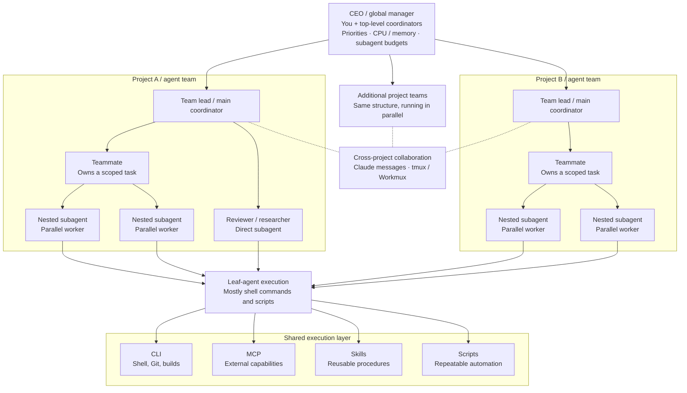

# Agent company

```mermaid
flowchart TD
    ceo["CEO / global manager<br/>You + top-level coordinators<br/>Priorities · CPU / memory · subagent budgets"]

    subgraph project_a["Project A / agent team"]
        direction TB
        lead_a["Team lead / main coordinator"]
        teammate_a["Teammate<br/>Owns a scoped task"]
        reviewer_a["Reviewer / researcher<br/>Direct subagent"]
        worker_a1["Nested subagent<br/>Parallel worker"]
        worker_a2["Nested subagent<br/>Parallel worker"]

        lead_a --> teammate_a
        lead_a --> reviewer_a
        teammate_a --> worker_a1
        teammate_a --> worker_a2
    end

    subgraph project_b["Project B / agent team"]
        direction TB
        lead_b["Team lead / main coordinator"]
        teammate_b["Teammate<br/>Owns a scoped task"]
        worker_b1["Nested subagent<br/>Parallel worker"]
        worker_b2["Nested subagent<br/>Parallel worker"]

        lead_b --> teammate_b
        teammate_b --> worker_b1
        teammate_b --> worker_b2
    end

    more["Additional project teams<br/>Same structure, running in parallel"]
    collaborate["Cross-project collaboration<br/>Claude messages · tmux / Workmux"]

    ceo --> lead_a
    ceo --> lead_b
    ceo --> more

    lead_a -.- collaborate
    lead_b -.- collaborate
    more -.- collaborate

    worker_a1 & worker_a2 & reviewer_a & worker_b1 & worker_b2 --> execute
    execute["Leaf-agent execution<br/>Mostly shell commands and scripts"]

    subgraph tools["Shared execution layer"]
        direction LR
        cli["CLI<br/>Shell, Git, builds"]
        mcp["MCP<br/>External capabilities"]
        skills["Skills<br/>Reusable procedures"]
        scripts["Scripts<br/>Repeatable automation"]
    end

    execute --> cli
    execute --> mcp
    execute --> skills
    execute --> scripts
```
